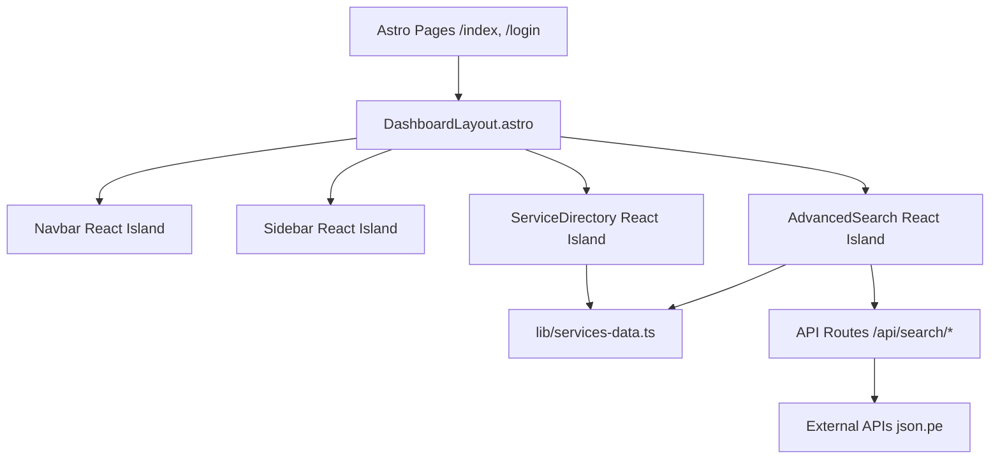

# Technical Design: Astro Migration

## Architecture Overview

The platform will transition from a full Next.js application to an **Astro-powered Multi-Page Application (MPA)** where interactivity is handled by **React Islands**.

## Implementation Details

### 1. Styling Strategy (Tailwind 4)

- We will use `@tailwindcss/vite` plugin in `astro.config.mjs`.
- `src/styles/globals.css` will contain the main Tailwind imports and glassmorphism utilities.

### 2. State Management

- No global state manager (Redux/Zustand) is used. Component-level state with `useState` in React islands is sufficient.
- Shared data flows through `lib/` utilities.

### 3. API Bridge

- Astro API routes in `src/pages/api/*.ts` will replicate the logic currently in `app/api/*.ts`.
- Environment variables (`JSON_PE_TOKEN`) will be accessed via `import.meta.env` or `process.env` depending on the Astro environment.

### 4. Interactive Directives

- `AdvancedSearch.tsx`: `client:load` (essential for immediate use).
- `ServiceDirectory.tsx`: `client:visible` (deferred until seen for better performance).
- `Navbar.tsx`: `client:load`.
